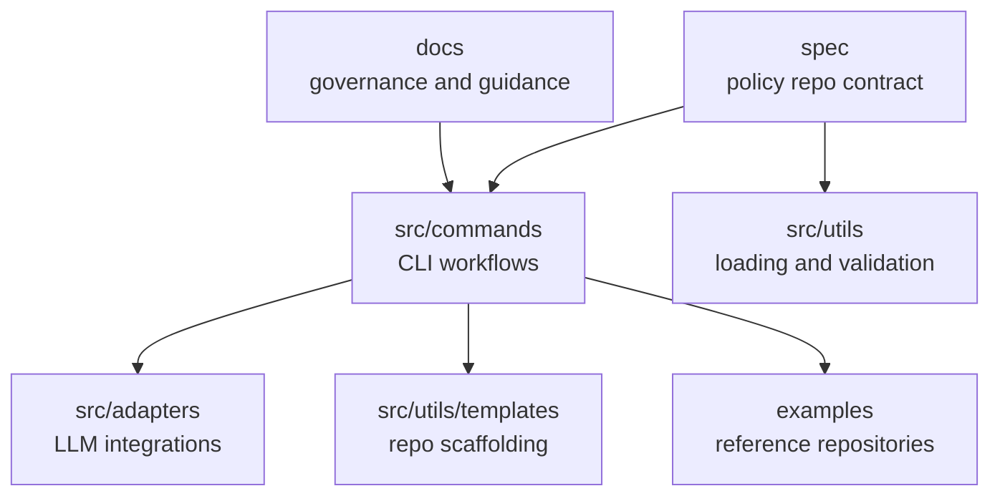
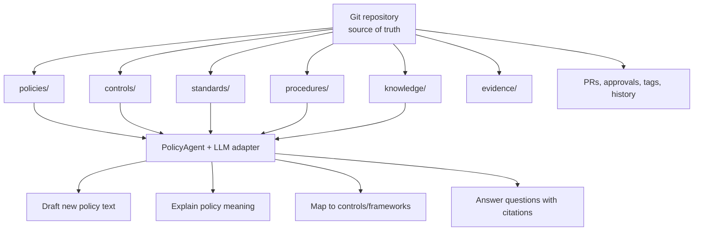

# PolicyAgent Architecture

## Overview

PolicyAgent has two layers:

1. The PolicyAgent framework repository
2. A PolicyAgent-managed policy repository

The framework provides the CLI, adapters, templates, and validation logic.

The policy repository holds the actual policies, controls, procedures, and governance documents.

## Framework Architecture

## Policy Repository Architecture

## Key Design Decisions

### Git Is the Lifecycle

PolicyAgent does not replace Git workflows. It makes them easier to use for policy work.

Git handles:

- approval flow
- release points
- change tracking
- attribution

### LLM Is the Writing Assistant

The LLM is used for language-heavy tasks only.

The LLM helps:

- create drafts
- explain existing text
- compare versions
- answer questions using documents

The LLM does not become the source of truth. The repository stays the source of truth.

### Adapters Prevent Lock-In

All provider-specific logic belongs in `src/adapters`.

This keeps the rest of the project stable while allowing connections to:

- OpenAI
- Anthropic
- Google
- Azure-hosted models
- internal enterprise LLMs

